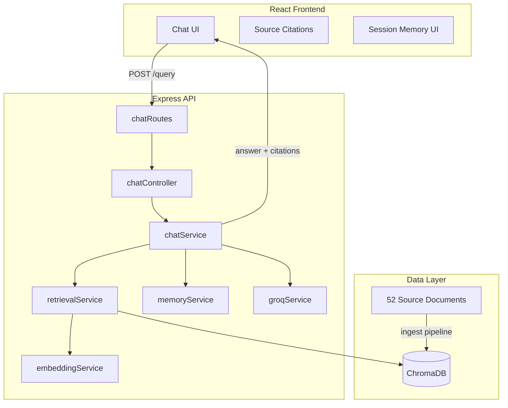

# RAG Chatbot Architecture

**Domain:** Artificial Intelligence  
**Stack:** React · Express · ChromaDB · Groq · @xenova/transformers

## System Overview

## Ingestion Pipeline

1. **Generate/load** 52 `.txt` files from `data/source_documents/`
2. **Preprocess** — normalize whitespace, extract metadata (title, docId, keywords)
3. **Chunk** — sliding word windows (400 words, 80 overlap)
4. **Embed** — `Xenova/all-MiniLM-L6-v2` via @xenova/transformers
5. **Store** — ChromaDB collection `ai_knowledge_base`

## Query Pipeline

1. **Session memory** — load last N messages for the session
2. **Query optimization** — Groq rewrites follow-ups into standalone search queries
3. **Embedding** — encode optimized query
4. **Hybrid retrieval**
   - Vector search in ChromaDB (cosine distance)
   - BM25 lexical search over full corpus
   - Reciprocal Rank Fusion (RRF) to merge rankings
5. **Rerank** — combined vector + keyword overlap score; keep top 5
6. **Generation** — Groq LLM with strict grounding prompt + context block
7. **Response** — answer, citations (title, excerpt, score), timing metadata

## Backend Modules

| Layer | Files | Responsibility |
|-------|-------|----------------|
| Routes | `chatRoutes.js` | HTTP mapping |
| Controllers | `chatController.js` | Request validation, responses |
| Services | `chatService`, `retrievalService`, `documentService`, `evaluationService` | Business logic |
| Utils | `preprocessing`, `chunking`, `bm25`, `rerank`, `metadata` | Pure functions |
| Middleware | `logger`, `errorHandler` | Cross-cutting concerns |
| Config | `env.js` | Environment variables |

## Evaluation Framework

**Retrieval (35 test cases)**

- Precision@1, @3, @5
- Recall@1, @3, @5
- Mean Reciprocal Rank (MRR)
- Hit Rate

**Answer quality**

- Correctness (token overlap vs expected)
- Faithfulness (answer tokens supported by context)
- Context relevance (query–chunk overlap)
- Completeness (expected concept coverage)
- Response time (ms)

## Technology Choices

| Component | Choice | Rationale |
|-----------|--------|-----------|
| Vector DB | ChromaDB | Native similarity search, metadata filters, Docker deploy |
| Embeddings | MiniLM (local) | No extra API cost; runs offline after model download |
| LLM | Groq (Llama 3.3 70B) | Fast inference, OpenAI-compatible API |
| Hybrid search | BM25 + vectors + RRF | Improves recall for exact terminology |
| Memory | In-process session map | Simple conversational follow-ups |

## Security Notes

- Store `GROQ_API_KEY` only in `.env` (never commit)
- CORS restricted to `FRONTEND_URL`
- LLM prompted to refuse hallucination outside context
